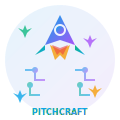

# 🚀 PitchCraft AI

<div align="center">
  
  
  **Transform your startup ideas into compelling pitches with AI-powered generation**
  
  [](https://reactjs.org/)
  [](https://vitejs.dev/)
  [](https://supabase.com/)
  [](https://tailwindcss.com/)
  [](https://ai.google.dev/)
</div>

---

## 📖 About

**PitchCraft AI** is an innovative web application that transforms your startup ideas into comprehensive business packages using artificial intelligence. Simply describe your vision, and our AI will generate a complete pitch deck, landing page copy, branding suggestions, and even production-ready website code.

### ✨ What Makes PitchCraft Special?

- **🤖 AI-Powered Generation**: Leverages Google's Gemini 2.0 Flash model for intelligent content creation
- **🎨 Complete Branding Package**: Generates logos, color schemes, and visual identity
- **💻 Ready-to-Deploy Code**: Creates production-ready HTML/CSS/JS landing pages
- **📊 Comprehensive Pitch Decks**: Detailed business analysis including market research and financial projections
- **🔄 Real-time Preview**: Instant preview of generated websites with live editing capabilities
- **☁️ Cloud Storage**: Secure storage and management of all your pitches via Supabase

---

## 🌟 Key Features

### 🎯 **Intelligent Pitch Generation**
- **Elevator Pitch Creation**: Concise, compelling summaries of your startup
- **Problem-Solution Analysis**: Clear articulation of market problems and your unique solution
- **Target Audience Identification**: Detailed customer segmentation and personas
- **Competitive Analysis**: Market positioning and differentiation strategies

### 🎨 **Professional Branding Suite**
- **Logo Concepts**: AI-generated logo ideas and design suggestions
- **Color Palette**: Carefully curated brand colors with hex codes
- **Typography Recommendations**: Font pairings that match your brand personality
- **Visual Identity Guidelines**: Complete brand style guide

### 💻 **Website Code Generation**
- **Responsive Design**: Mobile-first, fully responsive landing pages
- **Modern UI/UX**: Beautiful interfaces using Tailwind CSS
- **SEO Optimized**: Clean, semantic HTML with proper meta tags
- **Performance Focused**: Lightweight, fast-loading code

### 📱 **User Experience**
- **Intuitive Interface**: Clean, modern design with smooth animations
- **Real-time Collaboration**: Save and manage multiple pitch projects
- **Keyboard Shortcuts**: Power-user features for efficient navigation
- **Mobile Responsive**: Works seamlessly across all devices

---

## 🛠️ Technology Stack

| Category | Technology | Purpose |
|----------|------------|---------|
| **Frontend** | React 19.1.1 | Modern UI framework with latest features |
| **Build Tool** | Vite 7.1.7 | Lightning-fast development and building |
| **Styling** | Tailwind CSS 4.1.14 | Utility-first CSS framework |
| **Animations** | Framer Motion 12.23.24 | Smooth, professional animations |
| **Backend** | Supabase | Authentication, database, and real-time features |
| **AI Engine** | Google Gemini 2.0 Flash | Advanced language model for content generation |
| **Deployment** | Vercel/Netlify Ready | Optimized for modern hosting platforms |

---

## 🚀 Quick Start

### Prerequisites

- **Node.js** (v18 or higher)
- **npm** or **yarn** package manager
- **Supabase Account** (free tier available)
- **Google AI Studio API Key** (free tier available)

### Installation

1. **Clone the repository**
   ```bash
   git clone https://github.com/yourusername/pitchcraft-ai.git
   cd pitchcraft-ai/frontend
   ```

2. **Install dependencies**
   ```bash
   npm install
   # or
   yarn install
   ```

3. **Environment Setup**
   
   Copy the example environment file:
   ```bash
   cp .env.example .env
   ```
   
   Fill in your credentials in `.env`:
   ```env
   # Supabase Configuration
   VITE_SUPABASE_URL=your_supabase_project_url_here
   VITE_SUPABASE_ANON_KEY=your_supabase_anon_key_here
   
   # Google Gemini AI Configuration
   VITE_GEMINI_API_KEY=your_gemini_api_key_here
   ```

4. **Start the development server**
   ```bash
   npm run dev
   # or
   yarn dev
   ```

5. **Open your browser**
   
   Navigate to `http://localhost:5173` to see the application running.

---

## 📋 Usage Guide

### Getting Started

1. **Sign Up/Login**: Create an account or sign in with your existing credentials
2. **Describe Your Idea**: Enter a detailed description of your startup concept
3. **Generate Content**: Click "Generate Complete Startup Package" and wait for AI magic
4. **Review Results**: Explore your generated pitch, branding, and website code
5. **Preview Website**: Use the live preview feature to see your landing page
6. **Save & Manage**: Your pitches are automatically saved to your dashboard

### Example Input

```
I want to build an AI-powered fitness app that creates personalized workout 
plans with real-time form correction using computer vision, targeting busy 
professionals who want effective home workouts without expensive equipment 
or gym memberships.
```

### Generated Output

- **Complete Pitch Deck** with problem analysis, solution overview, and market research
- **Professional Branding** including logo concepts and color schemes
- **Landing Page Copy** with compelling headlines and call-to-actions
- **Production-Ready Code** for a beautiful, responsive website

---

## 🎨 Screenshots

<div align="center">
  
  
</div>

<div align="center">
  
  
</div>

---

## 🔧 Development

### Available Scripts

| Command | Description |
|---------|-------------|
| `npm run dev` | Start development server with hot reload |
| `npm run build` | Build production-ready application |
| `npm run preview` | Preview production build locally |
| `npm run lint` | Run ESLint for code quality checks |

### Project Structure

```
src/
├── components/          # React components
│   ├── Auth.jsx        # Authentication component
│   ├── PitchForm.jsx   # Main pitch generation form
│   └── MyPitches.jsx   # Pitch management dashboard
├── lib/                # Utility libraries
│   └── supabaseClient.js # Supabase configuration
├── assets/             # Static assets (images, icons)
├── App.jsx            # Main application component
├── main.jsx           # Application entry point
└── index.css          # Global styles and Tailwind imports
```

### Key Features Implementation

- **AI Integration**: Gemini API calls with structured prompts for consistent output
- **Real-time Updates**: Supabase real-time subscriptions for live data
- **Responsive Design**: Mobile-first approach with Tailwind CSS
- **State Management**: React hooks for efficient state handling
- **Error Handling**: Comprehensive error boundaries and user feedback

---

## 🤝 Contributing

We welcome contributions from the community! Here's how you can help:

### Ways to Contribute

- 🐛 **Bug Reports**: Found a bug? Please open an issue with detailed steps to reproduce
- 💡 **Feature Requests**: Have an idea? Share it in our discussions
- 🔧 **Code Contributions**: Submit pull requests for bug fixes or new features
- 📖 **Documentation**: Help improve our docs and examples
- 🎨 **Design**: Contribute UI/UX improvements and design assets

### Development Setup

1. **Fork the repository** on GitHub
2. **Create a feature branch**: `git checkout -b feature/amazing-feature`
3. **Make your changes** and test thoroughly
4. **Commit your changes**: `git commit -m 'Add amazing feature'`
5. **Push to your branch**: `git push origin feature/amazing-feature`
6. **Open a Pull Request** with a clear description

### Code Style Guidelines

- Use **ESLint** configuration provided in the project
- Follow **React best practices** and hooks patterns
- Write **meaningful commit messages** using conventional commits
- Add **comments** for complex logic and algorithms
- Ensure **responsive design** for all new UI components

---

## 📄 License

This project is licensed under the **MIT License** - see the [LICENSE](LICENSE) file for details.

```
MIT License

Copyright (c) 2024 PitchCraft AI

Permission is hereby granted, free of charge, to any person obtaining a copy
of this software and associated documentation files (the "Software"), to deal
in the Software without restriction, including without limitation the rights
to use, copy, modify, merge, publish, distribute, sublicense, and/or sell
copies of the Software, and to permit persons to whom the Software is
furnished to do so, subject to the following conditions:

The above copyright notice and this permission notice shall be included in all
copies or substantial portions of the Software.
```

---

## 🙏 Acknowledgments

- **Google AI** for providing the powerful Gemini 2.0 Flash model
- **Supabase** for the excellent backend-as-a-service platform
- **Vercel** for seamless deployment and hosting
- **Tailwind CSS** for the beautiful utility-first styling framework
- **Framer Motion** for smooth and professional animations
- **React Team** for the amazing frontend framework

---

## 📞 Support & Contact

- **📧 Email**: support@pitchcraft.ai
- **🐛 Issues**: [GitHub Issues](https://github.com/yourusername/pitchcraft-ai/issues)
- **💬 Discussions**: [GitHub Discussions](https://github.com/yourusername/pitchcraft-ai/discussions)
- **📱 Twitter**: [@PitchCraftAI](https://twitter.com/pitchcraftai)

---

<div align="center">
  <p><strong>Built with ❤️ by Aun Abbas</strong></p>
  <p>⭐ Star this repo if you find it helpful!</p>
</div>
